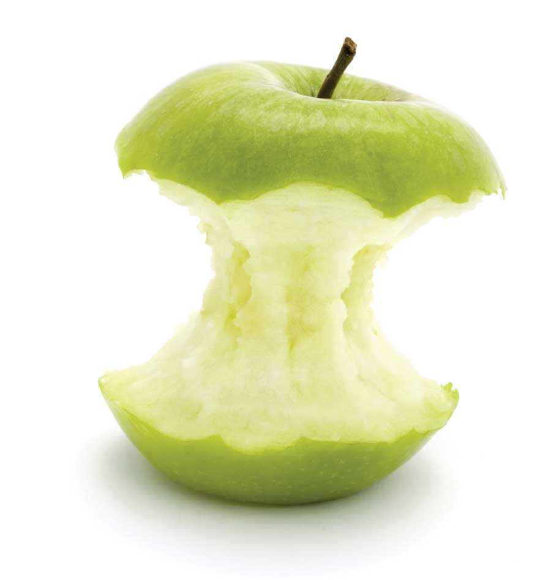
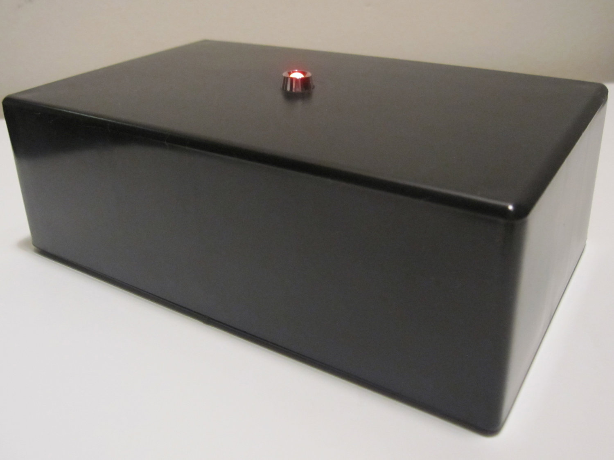
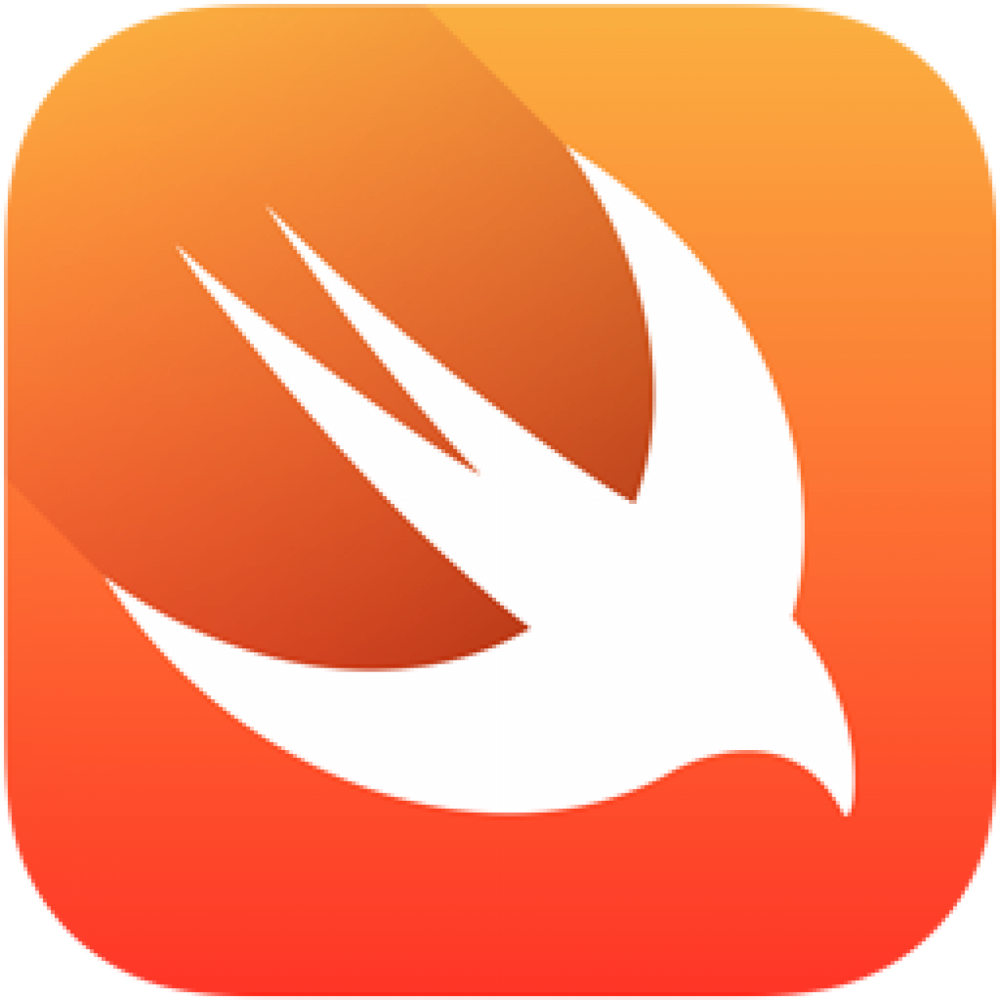
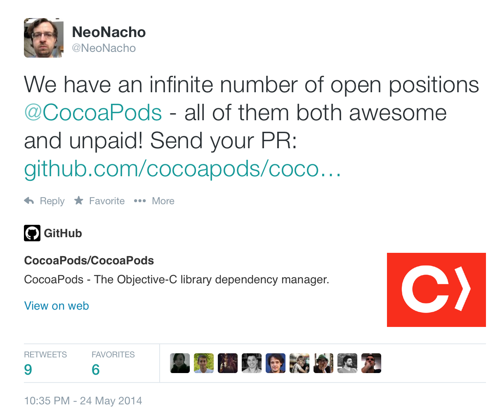

# CocoaPods Plugins

## mobiconf, October 2014

### Boris Bügling - @NeoNacho


---


---


-
-
-
-
-
-
-
-
-
-

### Core team member

---


## No

---


### Core team member

---


# Contentful

---

# Agenda

- CocoaPods itself
- Useful plugins
- How to build your own plugin
- Improving your workflow
- (Mini CocoaPods state of the union)


---

# CocoaPods


---

## the ~~de-facto~~ dependency manager


---


-
-
-
-
-
-
-
-
-
-
-
-
-
-

### created by this handsome guy

---

- Core
- cocoapods-downloader
- Xcodeproj
- CLAide
- CocoaPods


---

# Core

```ruby 
spec = Pod::Specification.from_file('CPDColors.podspec')
puts spec.name
puts spec.version

$ ./core.rb 
CPDColors
0.1.0
```



---

# cocoapods-downloader

```ruby
def download_head!
	hg! %|clone #{url} #{@target_path.shellescape}| [...]
end 

def download_revision!
	hg! %|clone "#{url}" --rev '#{options[:revision]}' #{@target_path [...]
end

def download_tag!
	hg! %|clone "#{url}" --updaterev '#{options[:tag]}' #{@target_path [...]
end 
```



---

# Xcodeproj

```ruby
wrkspace = Xcodeproj::Workspace.new_from_xcworkspace(
	'CPDColors/Example/Demo.xcworkspace')
puts wrkspace.schemes

$ ./xcodeproj.rb 
{"Demo"=>"/Users/boris/Projects/CPDColors/Example/Demo.xcodeproj", 
 "Pods"=>"/Users/boris/Projects/CPDColors/Example/Pods/Pods.xcodeproj"}
```


---

# CLAide

```ruby
argv = CLAide::ARGV.new(['tea', '--no-milk', '--sweetner=honey'])
argv.shift_argument     # => 'tea'
argv.shift_argument     # => nil
argv.flag?('milk')      # => false
argv.flag?('milk')      # => nil
argv.option('sweetner') # => 'honey'
argv.option('sweetner') # => nil
```


---

# CocoaPods

```bash
$ pod install
Analyzing dependencies
Pre-downloading: `DBCamera` from `https://github.com/[...]`
Downloading dependencies
Installing ARASCIISwizzle (1.1.0)
Installing Bolts (1.1.0)
[...]
Generating Pods project
Integrating client project
```


---

# CocoaPods plugins


---

# CocoaPods plugins

- Add subcommands to `pod`, the tool
- `post_install` hook
- Each plugin is a Gem


---

## Do whatever you want, because Ruby 💎


---

# Useful plugins


---

```bash
$ pod trunk push
```


---

```bash
$ pod plugins list
```


---

- Uses <https://github.com/CocoaPods/cocoapods.org/blob/master/plugins.json>


---

```bash
$ pod try BBUSegmentedViewController
```


---

```bash	
$ pod lib docstats
```


---

```bash
$ pod lib testing
```


---

```bash
$ pod lib coverage
```


---


```bash 
$ pod keys set AccessToken 0xFFFFFFFF
```


---

```bash
$ pod package ContentfulDeliveryAPI.podspec
```


---

```bash	
$ pod roulette
```


--- 

# How to build your own plugin


---

```bash
$ pod plugins create cocoapods-awesome-plugin
```


---

```bash
$ tree
.
├── Gemfile
├── LICENSE.txt
├── README.md
├── Rakefile
├── cocoapods_awesome_plugin.gemspec
└── lib
    ├── cocoapods_awesome_plugin.rb
    ├── cocoapods_plugin.rb
    └── pod
        └── command
            └── plugin.rb

3 directories, 8 files
```


---

```ruby
module Pod
  class Command
    class Plugin < Command
      self.summary = "Short description."

      self.arguments = [CLAide::Argument.new('NAME', true)]

      def initialize(argv)
        @name = argv.shift_argument
        super
      end

      def validate!
        super
        help! "A Pod name is required." unless @name
      end

      def run
        UI.puts "Add your implementation here"
      end
```


---

# Hooks


---

```ruby
Pod::HooksManager.register(:post_install) do |options|
  require 'installer'

  UI.puts "This gets executed after installation"
end
```


---


---

# What?

- Package a Pod as a static framework
- Including dependencies
- All supported platforms
- Generate a corresponding podspec


---

	$ pod package AFNetworking.podspec


---

# Let's get started


---

```bash
$ pod plugins create cocoapods-packager
```


---

# Template

- Just a Git repo, similar to the pod template
- Reads as much from the environment as possible
- Result is installable, shippable


---

# Define the command

```ruby
module Pod
	class Command
		class Package < Command
			self.summary = 'Package a podspec into a static library.'
  			self.arguments = [['NAME', :required]]

			[...]

		end
	end
end
```


---

# Parse the spec

```ruby
def spec_with_path(path)
    if !path.nil? && Pathname.new(path).exist?
      @path = path
      Specification.from_file(path)
    end
end
```


---

# run

```ruby
def run
    if @spec
      builder = SpecBuilder.new(@spec)
      newspec = builder.spec_metadata

      @spec.available_platforms.each do |platform|
        build_in_sandbox(platform)

        newspec += builder.spec_platform(platform)
      end

      newspec += builder.spec_close
      File.open(@spec.name + '.podspec', 'w') { |file| file.write(newspec) }
    else
      help! 'Unable to find a podspec with path or name.'
    end
end
```


---

# Fragment of SpecGenerator

```ruby
s.#{platform.name}.platform = :#{platform.symbolic_name}, 
	'#{platform.deployment_target}'
s.#{platform.name}.preserve_paths = '#{fwk_base}'
s.#{platform.name}.public_header_files  = 
	'#{fwk_base}/Versions/A/Headers/*.h'
s.#{platform.name}.vendored_frameworks  = '#{fwk_base}'
```


---

# Build for a specific platform

```ruby
def build_in_sandbox(platform)
    config.sandbox_root       = 'Pods'
    config.integrate_targets  = false
    config.skip_repo_update   = true

    sandbox = install_pod(platform.name)

    UI.puts 'Building framework'
    xcodebuild

    versions_path, headers_path = create_framework_tree(platform.name.to_s)
    `cp #{sandbox.public_headers.root}/#{@spec.name}/*.h #{headers_path}`

    Pathname.new(config.sandbox_root).rmtree
    Pathname.new('Podfile.lock').delete
end
```


---

# Install from generated Podfile

```ruby
def install_pod(platform_name)
    podfile = podfile_from_spec(platform_name, 
    	@spec.deployment_target(platform_name))
    sandbox = Sandbox.new(config.sandbox_root)
    installer = Installer.new(sandbox, podfile)
    installer.install!

    sandbox
end
```


---

# Generate that Podfile

```ruby
def podfile_from_spec(platform_name, deployment_target)
    name     = @spec.name
    path     = @path
    podfile  = Pod::Podfile.new do
      platform(platform_name, deployment_target)
      if path
        pod name, :podspec => path
      else
        pod name, :path => '.'
      end
    end
    podfile
end
```


---

```bash
$ rake install
```


---

	$ pod package AFNetworking.podspec


---

- Push your repo to GH
- Release as Ruby Gem
- Send a PR to the cocoapods.org repo


---

```bash
	$ git push

	$ rake release

	$ gem install cocoapods-packager
```


---

# 💥


---

# Improving your workflow


---

# The contentful.objc Makefile

```
WORKSPACE=ContentfulSDK.xcworkspace

.PHONY: all clean doc example example-static pod really-clean static-lib test

clean:
  rm -rf build Examples/UFO/build Examples/*.zip

really-clean: clean
  rm -rf Pods $(HOME)/Library/Developer/Xcode/DerivedData/*

all: test example-static

pod:
  pod install

example:
  set -o pipefail && xcodebuild -workspace $(WORKSPACE) \
    -scheme ContentfulDeliveryAPI \
    -sdk iphonesimulator | xcpretty -c
  set -o pipefail && xcodebuild -workspace $(WORKSPACE) \
    -scheme 'UFO Example' \
    -sdk iphonesimulator | xcpretty -c

example-static: static-lib
  cd Examples/UFO; set -o pipefail && xcodebuild \
    -sdk iphonesimulator | xcpretty -c

static-lib:
  @sed -i '' -e 's/GCC_GENERATE_TEST_COVERAGE_FILES = YES/GCC_GENERATE_TEST_COVERAGE_FILES = NO/g' ContentfulSDK.xcodeproj/project.pbxproj
  @sed -i '' -e 's/GCC_INSTRUMENT_PROGRAM_FLOW_ARCS = YES/GCC_INSTRUMENT_PROGRAM_FLOW_ARCS = NO/g' ContentfulSDK.xcodeproj/project.pbxproj

  set -o pipefail && xcodebuild VALID_ARCHS='i386 x86_64 armv7 armv7s arm64' -workspace $(WORKSPACE) \
    -scheme Pods-ContentfulDeliveryAPI \
    -sdk iphonesimulator | xcpretty -c
  set -o pipefail && xcodebuild VALID_ARCHS='i386 x86_64 armv7 armv7s arm64' -workspace $(WORKSPACE) \
    -scheme 'Static Framework' | xcpretty -c

  @cd Examples/UFO/Distribution; ./update.sh
  cd Examples; ./ship_it.sh

  @sed -i '' -e 's/GCC_GENERATE_TEST_COVERAGE_FILES = NO/GCC_GENERATE_TEST_COVERAGE_FILES = YES/g' ContentfulSDK.xcodeproj/project.pbxproj
  @sed -i '' -e 's/GCC_INSTRUMENT_PROGRAM_FLOW_ARCS = NO/GCC_INSTRUMENT_PROGRAM_FLOW_ARCS = YES/g' ContentfulSDK.xcodeproj/project.pbxproj

test: example
  set -o pipefail && xcodebuild -workspace $(WORKSPACE) \
    -scheme ContentfulDeliveryAPI \
    -sdk iphonesimulator -destination 'name=iPhone Retina (4-inch)' \
    test | xcpretty -c

doc:
  appledoc --project-name 'Contentful Delivery API' \
    --project-version 1.0 \
    --project-company 'Contentful GmbH' \
    --company-id com.contentful \
    --output ./doc \
    --create-html \
    --no-create-docset \
    --no-install-docset \
    --no-publish-docset \
    --no-keep-intermediate-files \
    --no-keep-undocumented-objects \
    --no-keep-undocumented-members \
    --merge-categories \
    --warn-missing-output-path \
    --warn-missing-company-id \
    --warn-undocumented-object \
    --warn-undocumented-member \
    --warn-empty-description \
    --warn-unknown-directive \
    --warn-invalid-crossref \
    --warn-missing-arg \
    --logformat 1 \
    --verbose 2 ./Code
```

---

# The contentful-management.objc Makefile

```
```

---

- cocoapods-testing
- cocoapods-coverage
- cocoapods-packager
- cocoapods-docstats
- ...


---

# Thank you!


---

# Swift funtime



---



---

# Links

- <http://www.objc.io/issue-6/cocoapods-under-the-hood.html>
- <http://guides.cocoapods.org>
- <https://github.com/CocoaPods/Rainforest>


---

- <http://buegling.com/talks>
- @NeoNacho
- boris@contentful.com


---

# Mini state of the union


---

# 0.34

- Dependencies per build configuration
- Private spec repositories
- Faster downloads
- Reorganisation of the Pods directory
- Foundation work


---

# Deterministic Podfile

```
source 'https://github.com/CocoaPods/Specs'
source 'https://github.com/Organization/Specs'
```


---

# Do not use `PODS_ROOT`


---

# 0.34.2


---

# Swift Pods support is coming

- there are no Swift static libraries
- CocoaPods needs to support frameworks
- You can use existing Pods in your Swift apps just fine


---

## @mrackwitz


---


