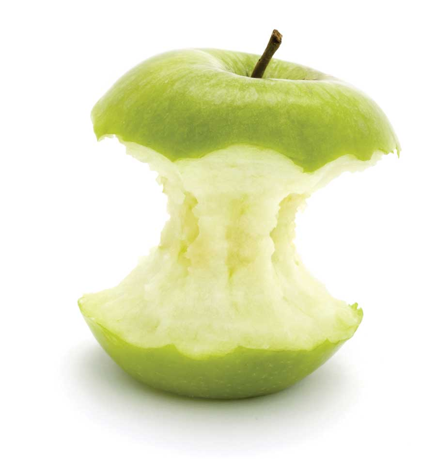

# CocoaPods Plugins

## CocoaHeads Berlin, July 2014

### Boris Bügling - @NeoNacho


---

# Yo


---

# Agenda

- CocoaPods itself
- Useful plugins
- How to build your own plugin


---

# CocoaPods


---

## the ~~de-facto~~ dependency manager


---


---

- Core
- cocoapods-downloader
- Xcodeproj
- CLAide
- CocoaPods


---

# Core

```ruby 
spec = Pod::Specification.from_file('CPDColors.podspec')
puts spec.name
puts spec.version

$ ./core.rb 
CPDColors
0.1.0
```



---

# cocoapods-downloader

```ruby
def download_head!
	hg! %|clone #{url} #{@target_path.shellescape}| [...]
end 

def download_revision!
	hg! %|clone "#{url}" --rev '#{options[:revision]}' #{@target_path [...]
end

def download_tag!
	hg! %|clone "#{url}" --updaterev '#{options[:tag]}' #{@target_path [...]
end 
```


---

# Xcodeproj

```ruby
wrkspace = Xcodeproj::Workspace.new_from_xcworkspace(
	'CPDColors/Example/Demo.xcworkspace')
puts wrkspace.schemes

$ ./xcodeproj.rb 
{"Demo"=>"/Users/boris/Projects/CPDColors/Example/Demo.xcodeproj", 
 "Pods"=>"/Users/boris/Projects/CPDColors/Example/Pods/Pods.xcodeproj"}
```


---

# CLAide

```ruby
argv = CLAide::ARGV.new(['tea', '--no-milk', '--sweetner=honey'])
argv.shift_argument     # => 'tea'
argv.shift_argument     # => nil
argv.flag?('milk')      # => false
argv.flag?('milk')      # => nil
argv.option('sweetner') # => 'honey'
argv.option('sweetner') # => nil
```


---

# CocoaPods

```bash
$ pod install
Analyzing dependencies
Pre-downloading: `DBCamera` from `https://github.com/[...]`
Downloading dependencies
Installing ARASCIISwizzle (1.1.0)
Installing Bolts (1.1.0)
[...]
Generating Pods project
Integrating client project
```


---

# CocoaPods plugins

- Add subcommands to `pod`, the tool
- Each plugin is a Gem
- Same access as built-in commands


---

# Useful plugins


---

```bash
$ pod trunk push
```


---

```bash
$ pod plugins list
```


---

- Uses <https://github.com/CocoaPods/cocoapods.org/blob/master/plugins.json>


---

```bash
$ pod try BBUSegmentedViewController
```


---

```bash	
$ pod lib docstats
```


---

```bash
$ pod lib testing
```


---

```bash
$ pod package ContentfulDeliveryAPI.podspec
```


---

```bash	
$ pod roulette
```


--- 

# How to build your own plugin


---

# What?

- Package a Pod as a static framework
- Including dependencies
- All supported platforms
- Generate a corresponding podspec


---

	$ pod package AFNetworking.podspec


---

# Let's get started


---

```bash
$ pod plugins create cocoapods-packager
```


---

# Template

- Just a Git repo, similar to the pod template
- Reads as much from the environment as possible
- Result is installable, shippable


---

# Define the command

```ruby
module Pod
	class Command
		class Package < Command
			self.summary = 'Package a podspec into a static library.'
  			self.arguments = [['NAME', :required]]

			[...]

		end
	end
end
```

---

# Parse the spec

```ruby
def spec_with_path(path)
    if !path.nil? && Pathname.new(path).exist?
      @path = path
      Specification.from_file(path)
    end
end
```

---

# run

```ruby
def run
    if @spec
      builder = SpecBuilder.new(@spec)
      newspec = builder.spec_metadata

      @spec.available_platforms.each do |platform|
        build_in_sandbox(platform)

        newspec += builder.spec_platform(platform)
      end

      newspec += builder.spec_close
      File.open(@spec.name + '.podspec', 'w') { |file| file.write(newspec) }
    else
      help! 'Unable to find a podspec with path or name.'
    end
end
```

---

# Fragment of SpecGenerator

```ruby
s.#{platform.name}.platform = :#{platform.symbolic_name}, 
	'#{platform.deployment_target}'
s.#{platform.name}.preserve_paths = '#{fwk_base}'
s.#{platform.name}.public_header_files  = 
	'#{fwk_base}/Versions/A/Headers/*.h'
s.#{platform.name}.vendored_frameworks  = '#{fwk_base}'
```

---

# Build for a specific platform

```ruby
def build_in_sandbox(platform)
    config.sandbox_root       = 'Pods'
    config.integrate_targets  = false
    config.skip_repo_update   = true

    sandbox = install_pod(platform.name)

    UI.puts 'Building framework'
    xcodebuild

    versions_path, headers_path = create_framework_tree(platform.name.to_s)
    `cp #{sandbox.public_headers.root}/#{@spec.name}/*.h #{headers_path}`

    Pathname.new(config.sandbox_root).rmtree
    Pathname.new('Podfile.lock').delete
end
```

---

# Install from generated Podfile

```ruby
def install_pod(platform_name)
    podfile = podfile_from_spec(platform_name, 
    	@spec.deployment_target(platform_name))
    sandbox = Sandbox.new(config.sandbox_root)
    installer = Installer.new(sandbox, podfile)
    installer.install!

    sandbox
end
```

---

# Generate that Podfile

```ruby
def podfile_from_spec(platform_name, deployment_target)
    name     = @spec.name
    path     = @path
    podfile  = Pod::Podfile.new do
      platform(platform_name, deployment_target)
      if path
        pod name, :podspec => path
      else
        pod name, :path => '.'
      end
    end
    podfile
end
```

---

```bash
$ rake install
```


---

	$ pod package AFNetworking.podspec


---

- Push your repo to GH
- Release as Ruby Gem
- Send a PR to the cocoapods.org repo


---

```bash
	$ git push

	$ rake release

	$ gem install cocoapods-packager
```


---

# 💥


---

# Future

- cocoapods-testing
- cocoapods-coverage
- cocoapods-playgrounds
- ...


---

# Thank you!


---

# Links

- <http://www.objc.io/issue-6/cocoapods-under-the-hood.html>
- <http://guides.cocoapods.org>
- <https://github.com/CocoaPods/Rainforest>


---

### <http://vu0.org/cp-plugins>
### @NeoNacho


---

### It's a zero!


